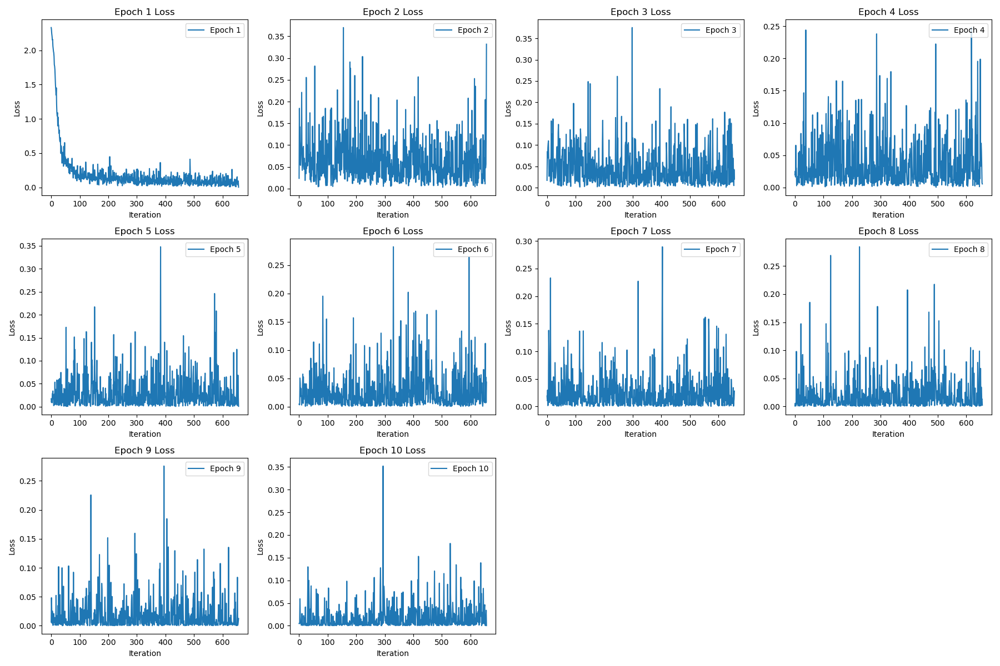

# SIL765 A5 REPORT

| Author: Yatharth Kumar | Entry Number: 2020CS10413 |

## Structure
- `train_data/`: This directory contains the MNIST training data. 
- `test_data/`: This directory contains the MNIST test data. 
- `assets/`: Images used in report.
- `setup.py`: This downloads and set ups the training and test data into appropriate directories.
- `model.py`: This implements the ANN for recognising handwritten images
- `attack.py`: This implements the FGSM attack on the implemented model.
- `model.pth`: Model trained in `model.py` is saved as `model.pth`.
- `README.md`: This is the file you're currently reading.
- `README.pdf`: This is the file you're currently reading.

## PART 1

> setup.py

This code fetches the MNIST dataset, splits it into training and testing sets (60:40 ratio), and saves these sets as images (in PNG format) along with their corresponding labels. The training and testing data are stored in separate directories (train_data and test_data). 

> model.py

The provided code implements an Artificial Neural Network (ANN) based on the LeNet-5 architecture to classify handwritten images. The training process is carried out using hyperparameters specified as follows:

```JSON
train_params = {
  "batch_size": 64,
  "learning_rate": 0.001,
  "epochs": 10
}
```
Key components of the implementation include:

1. Training and Testing: The LeNet-5 model is trained using the data stored in train_data. Testing is performed using the data from test_data.
2. Plotting Loss:: The code saves plots displaying the loss values across different epochs and iterations during training.
3. Model Saving: The trained model is saved as model.pth for future use or deployment.
4. Model Evaluation: After training, the saved model (model.pth) is loaded again. The loaded model is evaluated on both the training and test datasets.
5. Performance Metrics:
  - Train Accuracy: 99.37%
  - Test Accuracy: 98.57%


The screenshots for the same are attached [below](#screenshots).

#### Screenshots




## PART 2

> attack.py

This code implements a Fast Gradient Sign Method (FGSM) attack on a pre-trained model (model.pth) stored in the working directory. Key functionalities include:

1. Model Loading: Loads the pre-trained model (model.pth).
2. FGSM Attack: Applies FGSM attack on 1000 random images sampled from the test dataset (test_loader). Generates adversarial images using the FGSM technique.
3. Metrics: Calculates evasion rate, accuracy, and provides 1000 adversarial examples generated using FGSM.
4. Visualization: Plots the adversarial noises for 10 randomly chosen images.
5. Confusion Matrix: Generates a confusion matrix based on the actual and new predicted classes after the FGSM attack.

The attack parameters used for the attack are as follows:

```JSON
attack_params = {
  "batch_size": 1,
  "epsilon": 0.1,
  "learning_rate": 0.01,
  "model_name": "model.pth"
}
```

> Q1: Report the evasion rate of your generated adversarial examples against your trained model.

Evasion rate recorded is 45.2% as shown in the screenshot [below](#screenshot). Note that this is non-deterministic and changes at every run.

> Q2: Plot the corresponding adversarial examples and the corresponding adversarial noise.


> Q3: Randomly pick one digit and report to which class it got misclassified the most. Why do you think this is the case? Do you see any structural similarity between those two digits (your chosen digit and the most misclassified digit)?

From the confusion matrix shown [below](#screenshot) we can see that 7 is classified as 9, 42 number of times times after launching our FGSM attack, which is higher than 7 being classified as 7. The reason for this misclassification could be the structural similarity between 7 and 9. Digits 7 and 9 share similar stroke patterns in their representations, particularly when written in handwritten form. Both digits typically contain a downward stroke followed by a horizontal component. This similarity in stroke patterns may cause the model to struggle distinguishing between them, especially when subjected to perturbations that alter these features.

#### Screenshot


## References

I acknowledge the use of following resources:

1. https://pytorch.org/tutorials/beginner/fgsm_tutorial.html
2. https://blog.paperspace.com/writing-lenet5-from-scratch-in-python/

